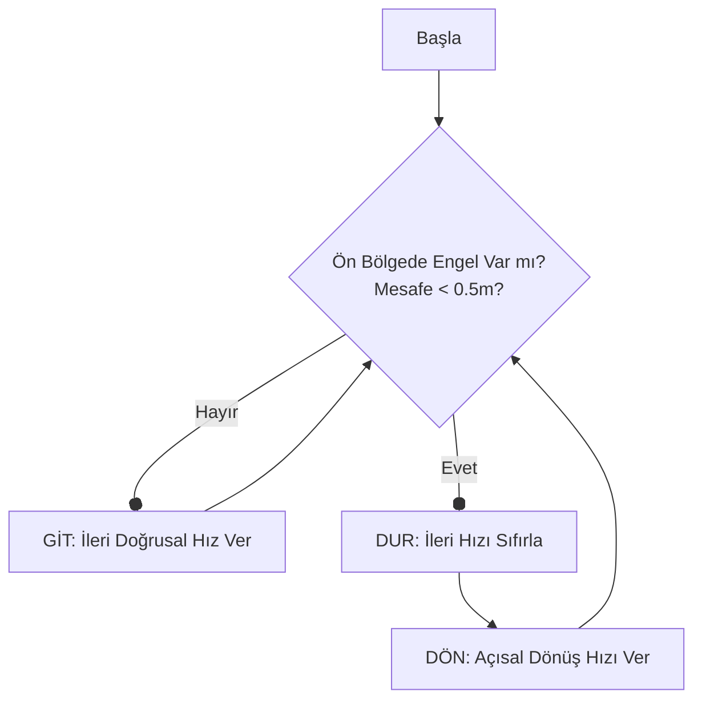

# 🛑 Ödev 4: Lidar ile Otonom Engelden Kaçma (Move-Stop-Rotate)

Bu paket, bir mobil robotun Lidar sensörü verilerini işleyerek önündeki engellerden çarpmadan kaçmasını sağlayan **Reaktif Engelden Kaçınma** algoritmasını uygulamak amacıyla geliştirilmiştir.

---

## 💡 Başlangıç Seviyesi Teorik Anlatım

### 1. Lidar Sensör Verisi (`LaserScan`) Nedir?
Lidar robotun lazerle çalışan gözüdür. Robotun üzerinden saniyede binlerce kez lazer ışını fırlatılır. 
*   Bu ışınlar $0^{\circ}$ ile $360^{\circ}$ arasında dairesel olarak döner.
*   Lidar verisi bize 360 elemanlı bir liste (`ranges`) olarak gelir. listenin her bir elemanı ilgili açıda engelin kaç metre uzakta olduğunu söyler.
*   Örneğin: `ranges[0]` robotun tam önünü, `ranges[180]` ise robotun tam arkasını temsil eder.

### 2. Move-Stop-Rotate (Git-Dur-Dön) Durum Makinesi
Bu ödevde robotun herhangi bir hedef koordinatı yoktur. Tek amacı sensörden gelen mesafeye göre **durum değiştirerek** çarpmayı önlemektir:

*   **Move (Git):** Lidar verisinde ön açılarda (sağ 40° ve sol 40° olmak üzere toplam 80°'lik ön alan) 0.5 metreden daha yakın engel yoksa robot ileri doğru güvenle ilerler.
*   **Stop (Dur):** Ön bölgedeki en yakın engelin mesafesi 0.5 metrenin altına indiği an robot motorlarını anında kapatır ve durur.
*   **Rotate (Dön):** Robot durduktan sonra, engel sensör açılarından çıkıp önü açılana kadar kendi ekseni etrafında döner. Önü temizlendiği an tekrar **Git** durumuna geçer.



---

## 🔍 Bu Ödevde Ne Yapılıyor?

1.  **Düğüm (`engel_kacinma.py`):** Lidar (`/scan`) konusunu dinler ve robotun motorlarına (`/cmd_vel`) hız komutları yayınlar.
2.  **Ön Koni Filtrelemesi:** Lidar verisinden sadece tam ön cepheyi temsil eden `ranges[0:40]` (sol ön) ve `ranges[320:360]` (sağ ön) dilimleri birleştirilerek taranır. Geçersiz ölçümler elenir.
3.  **Hız Komutları:** Koşullara göre robota doğrusal hız ($0.2$ m/s) veya açısal hız ($0.2$ rad/s) verilerek çarpışma engellenir.

---

## 🚀 Nasıl Çalıştırılır?

Aşağıdaki komutları sırasıyla farklı terminallerde çalıştırın:

**1. Gazebo Simülasyon Dünyasını Başlatın:**
```bash
export TURTLEBOT3_MODEL=waffle
roslaunch turtlebot3_gazebo turtlebot3_world.launch
```

**2. Otonom Engel Savar Düğümünü Çalıştırın:**
```bash
rosrun odev_4_engel_kacma engel_kacinma.py
```

*Not: Ödevin çalışmasını gösteren demo videosunu [videos/gorev1.mp4](./videos/gorev1.mp4) dosyasından izleyebilirsiniz.*
